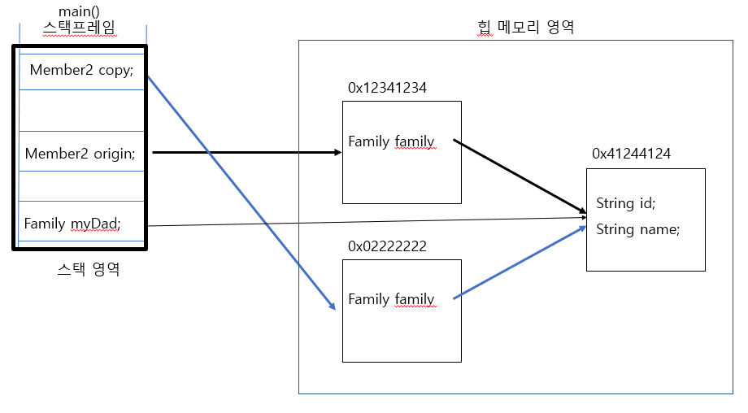
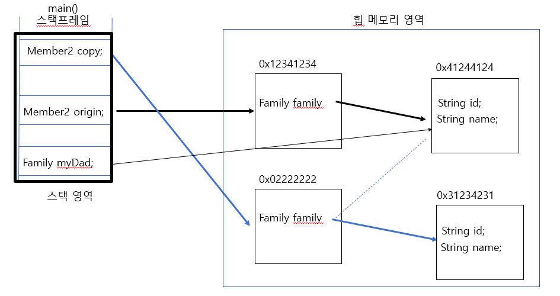

## 자바에서 객체의 얕은 복사


### 핵심 
1. 원본 객체와 복제본 객체 자신의 메모리 주소는 서로 다르다.
2. 원본 객체의 멤버와 복제본 객체의 멤버 중 Referenced Type은 서로 같은 객체를 가르키고 있다.
3. 원본 객체의 멤버와 복제본 객체의 멤버 중 Primitive Type은 서로 같은 값을 갖는다.
4. deep copy와 차이는, 복제되는 부분을 최소화 한다는 것.

### 원본-복제본 객체의 멤버간 공유하는 참조 객체에 대해
얕은 복사를 통해 생성한 copy 인스턴스는 origin 인스턴스와 마찬가지로 myDad 인스턴스를 참조한다.
이 때 myDad 인스턴스의 상태를 변경하면 서로 영향을 받을 수 있다.



이 경우 Family 타입의 myDad 참조변수가 가르키는 인스턴스의 name의 String 값을 변경 시킴.
- 그 결과, 원본 객체와 복제본 객체에 영향을 준다.

```java
class Member2 implements Cloneable {
    Family family;
    String id;
    String name;
    String pwd;
    int age;
    boolean adult;

    public Member2(Family family, String id, String name, String pwd, int age, boolean adult) {
        this.family = family;
        this.id = id;
        this.name = name;
        this.pwd = pwd;
        this.age = age;
        this.adult = adult;
    }

    public Member2 shallowCopy() throws CloneNotSupportedException {
        return (Member2) clone();
    }

    @Override
    public String toString(){
        return family.toString() +", id : " + id + ", name : " + name + ", pwd : " + pwd + " , age : " + age + ", adult : " + adult;
    }
}
```
```java
// Test 코드
public class MemberShallowCloneTest2 {

    /* original 객체와 shallow copied 객체 사이에서 서로 같은 Family 인스턴스를 공유하고 있다고 하자 */
    public static void main(String[] args) throws CloneNotSupportedException {
        Family dad = new Family("myDad", "Dad");
        Member2 origin = new Member2(dad, "junoade", "junho", "1234", 26, true);
        Member2 copy = junho.shallowCopy();


        hunho.family.name = "notMyDad";
        System.out.println("원본-복제 객체간 공유하는 Family 인스턴스의 멤버 값 변경 ");
        System.out.printf("원본 객체 주소 : %s  원본 객체의 내용 %s\n", origin.hashCode(), origin);
        System.out.printf("복제 객체 주소 : %s  복제 객체의 내용 %s\n", copy.hashCode(), copy);

        /**
         * 원본-복제 객체간 공유하는 Family 인스턴스의 멤버 값 변경
         * 원본 객체 주소 : 1784662007  원본 객체의 내용 id : myDad, name : notMyDad, id : junoade, name : junho, pwd : 1234 , age : 26, adult : true
         * 복제 객체 주소 : 1783593083  복제 객체의 내용 id : myDad, name : notMyDad, id : junoade, name : junho, pwd : 1234 , age : 26, adult : true
         */

    }
}
```

### 반면 인스턴스 멤버의 참조를 직접 바꾸는 경우...
예를 들어,
```java
Family dad = new Family("myDad", "Dad");
Member2 origin = new Member2(dad, "junoade", "junho", "1234", 26, true);
Member2 copy = origin.shallowCopy();

Family otherDad = new Family("otherDad", "Dad");
copy.family = otherDad; // 이때 부터, origin 객체와 copy 객체의 family 참조변수가 가르키는 family 인스턴스가 달라지게 됨.

```
- 이제 두 객체는 서로 다른 Family 인스턴스를 가르키게 된다.




### 참고하기
이것이 자바다 11장
https://stackoverflow.com/questions/184710/what-is-the-difference-between-a-deep-copy-and-a-shallow-copy
https://madplay.github.io/post/java-string-literal-vs-string-object
