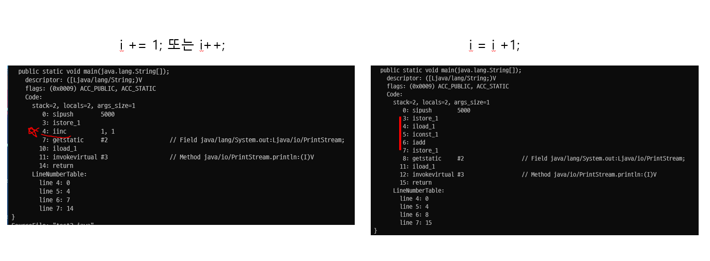
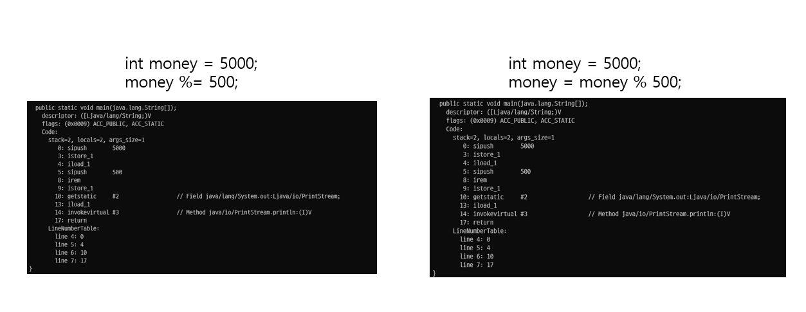

### 연산자, 바이트코드로 변환 실험

```shell
javap -v -p -s Test.class
```

덧셈과 뺄셈의 경우 iinc 연산자와 그 피연산자를 달리하여 

i += 1; i++; 의 경우에는 iinc 1 1 를 실행하고,

i-=1; i--; 의 경우에는 iinc 1 -1 를 실행한다.


반면 곱셈과 나눗셈, 나머지 연산에 대해서는
iload, iconst와 같은 연산자에 대한 라인을 먼저 실행하고  
mul, div, rem 연산 이후
store하는 과정을 갖는다.

