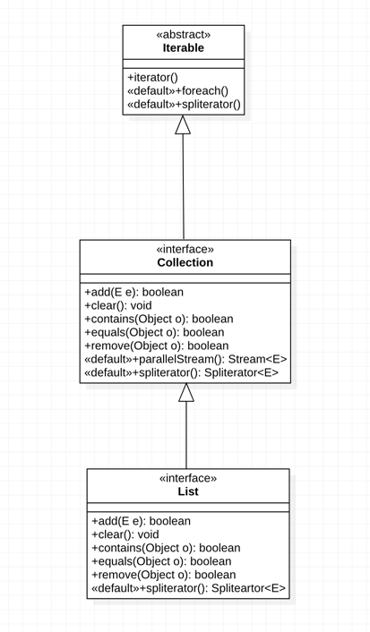

### 학습 내용

JCF (Java Collections Framework ) 를 학습하던 도중,
인터페이스에 대한 다중 상속 관계 구조에 대해 공부한 내용을 정리한다.


### 먼저, 클래스와 인터페이스의 차이점
- 클래스는 필드, 생성자, 메소드 등을 구성 멤버로 갖지만, 
- 인터페이스는 상수, 메소드만을 구성 멤버로 갖는다
  - 이때, 인터페이스는, 자바 8부터는, default 메소드와 static 메소드를 선언이 가능해 졌다.
  - 해당 부분은 상속받는 하위 인터페이스를 구현하는 클래스에서 굳이 override하여 구현하지 않아도 된다는 장점이 있다.
  - 그러나 해당 인터페이스를 상속받는 하위 인터페이스의 default 메소드에서 재정의가 가능하다. 

### 인터페이스 예시
```java
interface List<T> extends Collection<T> { // 다른 상위 인터페이스를 상속받을 수 있음. 
    
    /* 상수 필드, 초기값으로 초기화 필수 */
    // public abstract final 가 생략될 수 있음/
    [public static final] 타입 상수명 = 값; 
    
    /* 추상 메소드 */
    // public abstract 가 생략될 수 있음/
    [public abstract] 리턴 타입 메소드명(...);
    
    /* default 메소드 */
    // public 생략될 수 있음 
    [public] default 리턴 타입 메소드명(....) { /* implementation here */ }
    
    /* 정적 메소드 */
    // public 생략될 수 있음
    [public] static 리턴타입 메소드명(...){ /* implementation here */ }
    
}
```

### 인터페이스 간의 상속과 default 메소드의 활용
- 부모 인터페이스를 구현하는 여러 클래스들의 수정 없이, 부모 인터페이스에 default 메소드를 작성하여 새로운 기능의 클래스에서 활용가능하도록,
- 활용 방법
  1. default method를 단순히 상속받기
  2. default method를 재정의 하여 실행 내용 변경하기
  3. default method를 추상 메소드로 재선언하기


### MyList, MyCollection, MyIterable 인터페이스 예시
- 예를 들어 아래와 같은 인터페이스의 상속 구조가 있다고 하자.
> 자바 1.8의 jcf의 java docs를 일부 참고하였다.


예를 들어, Iterable 인터페이스에서 spliterator() 는 다음과 같이 default 메소드로 구현되어 있다.
```java
default Spliterator<T> spliterator() {
    return Spliterators.spliteratorUnknownSize(iterator(), 0);
}
```
그런데, 하위 인터페이스 Collectcion에서는 기존의 default 메소드, foreach는 그대로 상속받되, spliterator()는 재정의된다.
```java
@Override
default Spliterator<E> spliterator() {
    return Spliterators.spliterator(this, 0); // this는 해당 인터페이스를 구현하는 구현 객체의 인스턴스를 가르킴
}
```

또한 추가로, default method parallelStream()을 선언한다.  
``` java
default Stream<E> parallelStream() {
    return StreamSupport.stream(spliterator(), true);
}
```

> 참고로, 디폴트 메소드는 해당 인터페이스를 구현하는 구현체의 인스턴스 생성 이후 호출 가능하다.

마지막으로 인터페이스 List를 살펴보면, 
여기서, spliterator() 를 다음과 같이 overrideing하고 있다.
```java
@Override
default Spliterator<E> spliterator() {
    if (this instanceof RandomAccess) {
        return new AbstractList.RandomAccessSpliterator<>(this);
    } else {
        return Spliterators.spliterator(this, Spliterator.ORDERED);
    }
}
```
그 외에 상속받은 default 메소드를 그냥 사용하는 경우도 있다.


### 그렇다면, MyList를 인터페이스를 구현하는 MyJunhoList 클래스는 어떤 메소드를 구현해야할까?
default, static 메소드를 제외한 인터페이스의 상속계층에 있는 추상 메소드들을 구현하게 된다.
